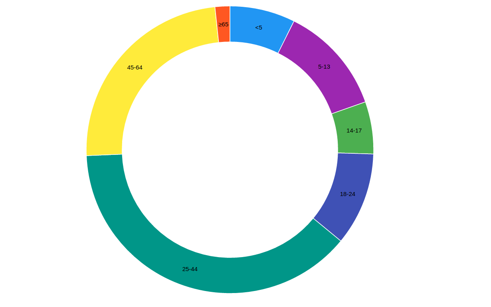
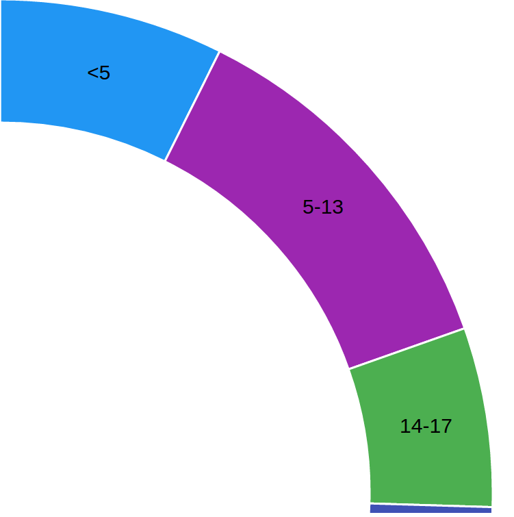

# D3-Click-Zoom
This project is Click-Zoom using D3.js.

## Quick Start

- clone our repo
```
$ git clone https://github.com/xdatavisualteam/d3-click-zoom.git
```

- Then run the project using Xampp, Wamp or other server.

# Result


## data.csv

```html
age,population
<5,2704659
5-13,4499890
14-17,2159981
18-24,3853788
25-44,14106543
45-64,8819342
≥65,612463

```
